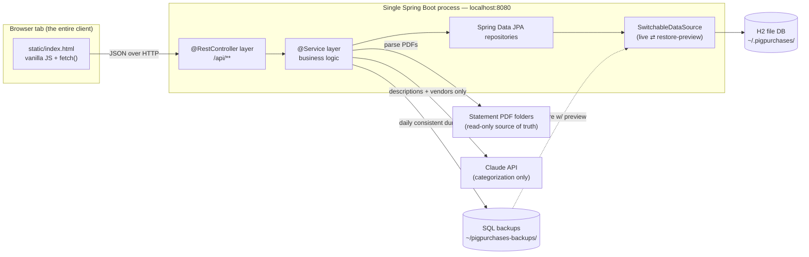
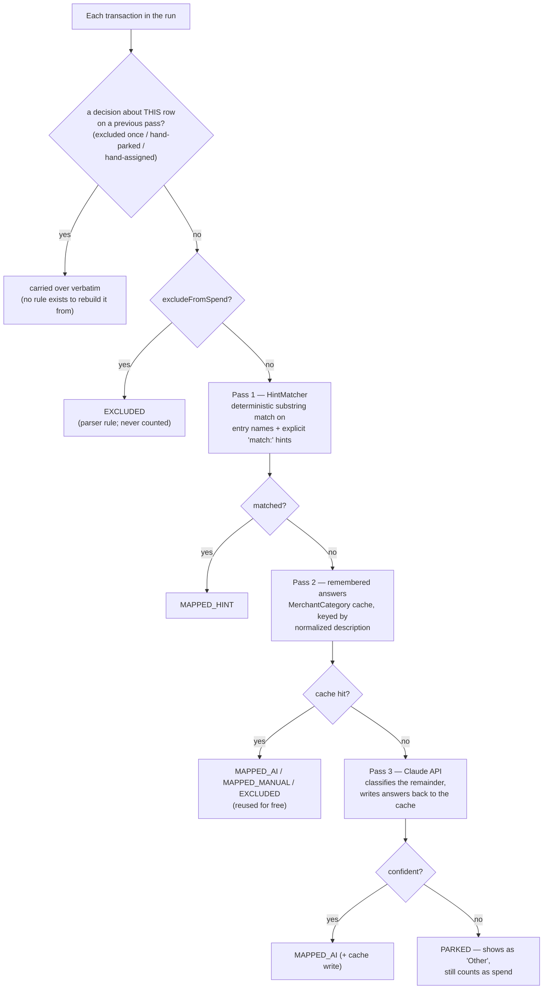
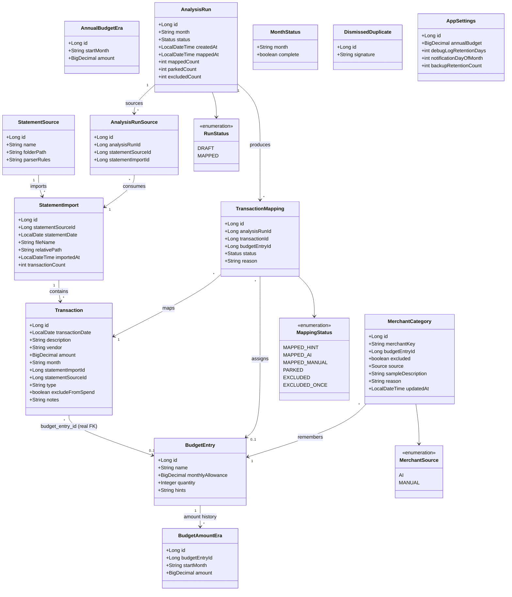
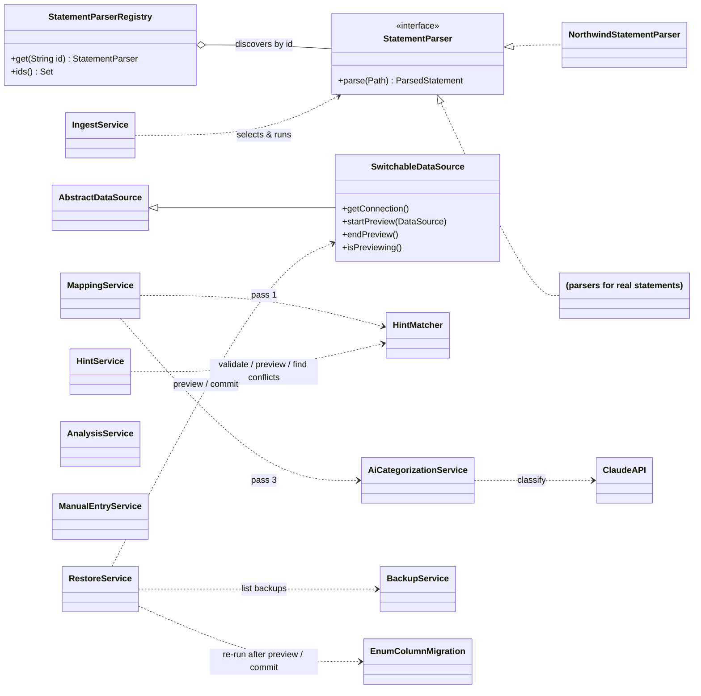
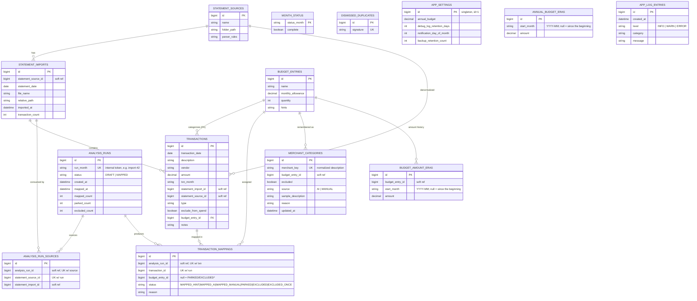

# PigPurchases — Architecture

A single-user desktop budgeting app. You point it at folders of bank/credit-card
statement PDFs; it parses them into transactions, categorizes each transaction
against your budget, and shows how actual spending tracks to budget per month and
on a rolling average. It runs entirely on your machine — the only thing that ever
leaves it is a transaction's *description and vendor text* — with account identifiers
stripped from both — sent to the Claude API to categorize the handful of transactions
the deterministic rules can't place.

- **Stack:** Spring Boot 3.5.16, Java 25, Spring Data JPA / Hibernate, embedded Tomcat on `:8080`.
- **Database:** H2 file database, one file, `ddl-auto=update` (no migration scripts; one programmatic column-type fix in `EnumColumnMigration` — see §7).
- **UI:** two hand-written files, no build step: `static/index.html` (markup, styles, DOM and fetch code) and `static/app-math.js` (the pure functions — money, dates, escaping, table sorting — split out so `AppMathTest` can run them). Vanilla JS, talking to a REST API.
- **Shape:** you run `PigPurchasesApplication`, a browser tab is the whole client. No multi-user, no cloud, and no login — but not no protection: the server binds `127.0.0.1` only, `LocalOriginFilter` refuses state-changing requests that did not come from this machine, and it sets a CSP and anti-framing headers. The bind and the filter are a pair — see §7.

---

## 1. Runtime topology

Two deliberate facts about this picture:

- **The PDFs are the source of truth, not the DB.** Everything in the database can
  be rebuilt by re-ingesting the folders. That's what makes the data-safety design
  (below) a convenience rather than a single point of failure.
- **`SwitchableDataSource` sits between JPA and H2** so a restore can be *previewed*
  against a backup without touching the live database until you commit.

---

## 2. Package / layer map

| Package | Role | Notable types |
|---|---|---|
| `parser` | Turn one issuer's PDF into `ParsedStatement`/`ParsedTransaction`. Strategy pattern, wired by discovery. | `StatementParser` (interface), `StatementParserRegistry`, `NorthwindStatementParser` (demonstration), `ExclusionRule` |
| `model` | JPA entities — the persistent domain. | `Transaction`, `BudgetEntry`, `BudgetAmountEra`, `AnnualBudgetEra`, `AnalysisRun`, `TransactionMapping`, `MerchantCategory`, … (14 total) |
| `repository` | Spring Data JPA interfaces, one per aggregate. | `TransactionRepository`, `AnalysisRunRepository`, … |
| `service` | All business logic. Ingest, the categorization pipeline, analysis math, budget history, AI, backup/restore. | `IngestService`, `MappingService`, `AnalysisService`, `BudgetHistoryService`, `AiCategorizationService`, `HintMatcher`, `HintService`, `BackupService`, `RestoreService`, `ManualEntryService`, `DebugLogService` |
| `server` | `@RestController`s (the `/api` surface) + `DataInitializer`. Thin — they marshal JSON and delegate. | `BudgetController`, `MappingController`, `AnalysisController`, `ManualEntryController`, `BackupController`, `RestoreController`, `HintController`, `DebugLogController`, `NotificationController` (9 in all) |
| `demo` | Generates sample statements and seed data so the app can be run with no data of anyone's own. Active only under the `demo` profile. | `DemoDataInitializer`, `DemoStatements` |
| `config` | Switchable-datasource plumbing, startup schema fixes, and the request-origin / security-header filter. | `DataSourceConfig`, `SwitchableDataSource`, `EnumColumnMigration`, `LocalOriginFilter` |

The dependency rule is the usual one: `server` → `service` → `repository` → `model`.
Controllers hold no logic worth testing; services are where the tests live.

---

## 3. The three core flows

### 3a. Ingest (PDF → transactions)

`IngestService.ingest(source, file)` picks the right `StatementParser` from the
source's configured rules, parses the PDF into `ParsedTransaction`s, records a
`StatementImport` (the batch), and persists `Transaction` rows. `ExclusionRule`s
(per source) mark transfers/payments as `excludeFromSpend` at parse time — they're
*kept* so every line is accounted for, but never counted as spend.

**Parsers are plugins.** `StatementParser` declares the ids it answers to and
`StatementParserRegistry` indexes every implementation on the classpath, so the ingest
path names no parser and does not need editing to add one. Two consequences:

- **The set of parsers can differ between checkouts.** This repository ships
  `NorthwindStatementParser`, a demonstration parser for an invented format. Setting the
  `parsers.dir` Maven property to another source tree compiles its parsers and tests
  alongside; leaving it undefined changes nothing. Dispatch is per *statement source* —
  each stores a parser id in its `parserRules` — so which parser runs is a property of
  the data, not of the build.
- **A duplicate id fails at startup**, rather than letting bean ordering decide which
  parser reads a statement. That kind of wrong reconciles to nothing and gets blamed on
  the statement.

**Reconciliation is the parser's own claim.** `printsControlTotals()` says whether an
issuer's statements print totals the parse can be checked against. True, and a statement
whose totals cannot be read is refused — a summary box that stopped matching is the same
layout change that makes rows go missing. False, and the parser needs a structural guard
of its own, because a "total" derived from the rows being checked cannot disagree with
them. This lived in `IngestService` as a hardcoded set of parser ids, which put knowledge
of specific issuers in a path that is otherwise parser-agnostic.

### 3b. Mapping (transactions → budget categories) — the heart of the app

Mapping is **per statement file**. Each `AnalysisRun` consumes exactly one
`StatementImport` (via an `AnalysisRunSource` link) and produces one
`TransactionMapping` per transaction. `MappingService.doMap()` runs three passes,
cheapest first, so the expensive one only ever sees what's left:

Why this shape matters:

- **Pass 1 is free and deterministic.** `HintMatcher` normalizes both sides to
  lowercase-alphanumeric, then substring-matches. Hints can be composite
  (`MP + MAILORDER` — all parts must appear); the longest/most-specific match wins,
  and a tie between different entries parks rather than guesses.
- **Pass 2 is why re-runs don't re-pay.** Every answer the AI or the user ever gave
  is stored in `merchant_categories` keyed on the normalized description. A manual
  answer beats an AI one. This is the cache that turns one manual fix into a
  permanent rule.
- **Pass 3 is the only one that costs money**, and only for genuinely new merchants.
  With no API credentials it's skipped silently and those transactions stay parked.
- **Parked ≠ excluded.** Parked transactions still count toward spend (they're real
  money you just haven't categorized); excluded ones are transfers that never count.
- **Excluding has a standing and a one-off form.** `EXCLUDED` writes a rule to
  `merchant_categories`, so the merchant is excluded forever after; `EXCLUDED_ONCE`
  writes nothing and applies to that transaction alone (spend covered by a gift, a
  reimbursed purchase). Because a one-off has no rule to be rebuilt from, it is the
  one decision `doMap` must carry across a re-map itself — it snapshots those rows
  before deleting and re-applies them ahead of every other pass. Both are excluded
  from spend identically; `TransactionMapping.countsAsSpend()` is the single test
  for that, and callers ask it rather than comparing statuses themselves.

Manual entry (`ManualEntryService`) and duplicate detection (with a persisted
"not a duplicate" dismissal, `DismissedDuplicate`) feed the same transaction table.

### 3c. Analysis (mappings → budget vs. actual)

`AnalysisService` aggregates `TransactionMapping`s **by each transaction's actual
`transactionDate`** (not the statement/ingest month), so a complete calendar month
is assembled regardless of which statement file each charge arrived in. A month is
only folded into the **rolling average** once you mark it complete (`MonthStatus`),
so a half-loaded month can't skew the typical-month numbers.

**Budgets are era-resolved** (`BudgetHistoryService`): every month is compared
against the budget in force *that* month, so changing a category's amount "going
forward" leaves past months measured against what they were lived under. The
Rolling screen averages the in-force budgets across the complete months — Budget −
Actual = Variance stays true in every row — and the per-category trend chart draws
the budget as a stepped line with a per-era breakdown beneath it. An entry with no
era rows resolves to its current amount for every month, which is the pre-era
behaviour and the fallback a restored old backup gets.

---

### 3d. Demo mode

`demo.cmd` runs the app against generated sample statements, so it can be tried with no
data of anyone's own. `application-demo.properties` redirects the database, redirects the
backup directory **and** disables backups, redirects the restore-preview directory, and
turns AI off.

**Four filesystem paths, each configured independently of the datasource**, which is why
redirecting the database alone is never enough. The backup directory matters even with
backups off, because `backupNow()` ignores the enabled flag — a demo left on the default
would write dumps of the demo database over the real daily backup, under the same
one-file-per-day name. The preview directory matters because previewing any backup builds
a throwaway database, and it used to be a bare `${user.home}` interpolation with no
property key, so no profile could move it: the demo's preview landed in `~/.pigpurchases`,
the live database's own folder.

The general rule this keeps re-teaching: a new setting that touches the filesystem or the
network needs asking whether demo mode has to redirect it too.

`DemoStatements` computes each statement's control totals from its own rows rather than
printing constants — ingest refuses a statement whose rows disagree with its printed
totals, so hardcoded totals would produce files the app rejects.

## 4. Data safety (learned the hard way)

The live DB once got reverted by OneDrive syncing the H2 file mid-session. The
current design is built around never repeating that:

- **The live DB lives outside any synced folder** — `~/.pigpurchases/`.
- **`BackupService`** writes a consistent SQL dump to `~/pigpurchases-backups/`,
  one file per day named by date, refreshed during the day only when data actually
  changed, pruned to a configurable retention count. Backups live outside both
  OneDrive and the live-db folder, so whatever can corrupt the live DB can't reach
  the history.
- **The anti-clobber baseline is the highest mapped-row count still in force**, recovered
  at startup from the backups' `.meta` sidecars. Seeding it from the *newest* sidecar
  alone let the guard switch itself off at the one moment it was needed: a backup that
  recorded zero mapped rows became the baseline, the guard's own "stay quiet below 20 rows"
  floor is not met at zero, and from then on every empty backup overwrote the day's real
  file in silence with nothing filed `.SUSPECT`. The scan stops at the newest *deliberate*
  new normal — a baseline the user accepted, or a restore commit — because that is the
  statement that everything older no longer applies, and it is what lets an accepted drop
  survive a restart rather than be re-flagged by last week's higher count.
- **`RestoreService` + `SwitchableDataSource`** make restore non-destructive: a
  chosen backup is loaded into a *preview* datasource and validated; the live DB is
  only overwritten when you explicitly commit. Both paths re-run
  `EnumColumnMigration` afterwards, because a dump rebuilds the schema exactly as
  that backup was written — so restoring one older than a status would otherwise
  quietly reintroduce the `ENUM` constraint it was created without.

---

## 5. UML class diagram

### 5a. Domain / persistence classes

Cardinalities are the logical relationships. Note: only `Transaction → BudgetEntry`
is a real JPA-managed association (`@ManyToOne` / FK `budget_entry_id`). Every other
link is a **soft reference** — a plain `Long ...Id` field the application resolves,
with no database foreign-key constraint (a consequence of `ddl-auto=update` over
by-id fields). This is called out again in the DB section.

### 5b. Behavioral classes — parser hierarchy & service dependencies

The only true inheritance hierarchy is the parser strategy; the rest is a
service/controller dependency graph.

---

## 6. Database (ER) diagram

H2 file DB, schema managed by Hibernate `ddl-auto=update`, with the one
programmatic exception noted in §7 (`EnumColumnMigration`). Because most
inter-table links are plain `Long` id fields (not JPA relationships), Hibernate
generates **no foreign-key constraints** for them — the relationships below are
enforced in application code, not by the database. The one real FK is
`transactions.budget_entry_id`. Reserved-word columns are renamed
(`run_month`, `txn_month`, `status_month`) because `month` is reserved in H2.

Unique constraints that *are* enforced: `analysis_runs.run_month`,
`merchant_categories.merchant_key`, `dismissed_duplicates.signature`,
`analysis_run_sources (analysis_run_id, statement_source_id)`, and
`transaction_mappings (analysis_run_id, transaction_id)`.

---

## 7. Key design decisions & invariants

- **Analysis groups by actual transaction date**, so a calendar month is complete
  regardless of which statement file each charge came in on. `AnalysisRun.month`
  is *not* a calendar month — it's an internal unique token (`import-{id}`) left
  over from the per-file mapping model; the rolling average uses `MonthStatus`.
- **Mapping is per statement file** — one `AnalysisRun` ⇒ one `StatementImport`.
  "Map Transactions" maps every unmapped file; "Re-run mapping" re-runs chosen ones.
- **Merchant answers are remembered, so the AI is only ever paid for once** per
  merchant; manual answers outrank AI answers in that cache.
- **Parked still counts as spend.** Uncategorized real money is never hidden from
  the budget totals — it lands in "Other."
- **Budgets are era-resolved: each month is compared against the budget in force
  that month.** A "changed going forward" edit records the old amount as a
  `BudgetAmountEra` (the first change also writes the old value as a
  since-the-beginning era); a "correct" edit amends in place and records nothing.
  An entry with **no** era rows resolves to its current amount for every month —
  the pre-era behaviour, and what a database restored from an old backup gets.
  The Rolling screen averages the in-force budgets across the complete months, so
  Budget − Actual = Variance stays true in every row. The annual budget is
  versioned the same way (`AnnualBudgetEra`), but only by an explicit change in
  Settings — never as a side effect of a category change.
- **The database is disposable; the PDFs and backups are not.** The DB stays out of
  synced folders, backups are consistent dumps kept outside the DB folder, and
  restore is preview-then-commit through `SwitchableDataSource`.
- **One programmatic migration, no migration scripts.** `ddl-auto=update` only
  adds, so new non-null columns on populated tables carry `@ColumnDefault` for
  Hibernate to back-fill. The one thing it cannot do is *widen* an existing column,
  which is why `EnumColumnMigration` converts the `@Enumerated(STRING)` columns
  from H2's native `ENUM(...)` to `VARCHAR` at startup — idempotent, best-effort,
  logged rather than thrown. That is what lets a new constant such as
  `EXCLUDED_ONCE` be stored on a database created before it existed. Its column
  list is verified against the entities by test, because a missing column is
  invisible until the day someone adds a constant to it.
- **A statement is reconciled before it is stored.** `IngestService` checks the parse
  against the control totals the statement itself prints — a deposit account's signed
  transactions must equal ending minus beginning balance; a card's positives and negatives
  must equal the printed purchases and credits — and refuses the import when they disagree. A
  parser that cannot determine a statement date, a year, or which rows
  belong to this cycle throws rather than guessing. Every outcome is written to the
  debug log, success included, so silence there means the ingest never ran.
- **Every per-transaction decision with no rule behind it survives a re-map.** Three have
  that shape (`MappingService.isPerTransactionDecision`): a one-off exclusion, parking a
  row by hand, and assigning a row to a category by hand. The first two write no
  `merchant_categories` rule — parking actively deletes one — so neither can be rebuilt
  from the cache. The third *does* write a rule, but the rule is keyed on the merchant
  rather than the row, so pass 2 rebuilds it as `MAPPED_MANUAL` with the reason
  "Remembered — your earlier categorization", which is exactly what
  `AnalysisService.inSpendBuckets` refuses to treat as a per-row decision; a refund the
  user had put into a category therefore left it again on the next re-map, and that
  category's total rose. `doMap` carries all three across the rebuild. Only a *deliberate*
  park qualifies, distinguished by its reason string: `PARKED` is also the status of
  everything no pass could place, and those must stay free for a newly added hint to
  claim.
- **A decision you made by hand outranks a hint.** Pass 2 considers hint-matched rows,
  but only a `MANUAL` merchant rule may override one; an `AI` answer may not, because
  the pattern is the user's own explicit rule and a guess is not. Without this, a
  remembered decision about a merchant the hint pass could match was written and never
  read back, so excluding or re-categorizing such a row was silently undone by the next
  re-map.
- **Re-ingest carries a statement's mappings onto the replacement rows**, matched by
  content (date + absolute amount + normalized description) rather than by row id, and
  re-points the consuming `AnalysisRunSource`. Deleting the old transactions without
  this left mappings pointing at rows that no longer existed: the statement contributed
  nothing to any month, its run vanished from the Mapping screen, and `EXCLUDED_ONCE`
  was unrecoverable.
- **Payments and deposits are kept out of spend unless you assigned that exact row by
  hand.** `signedSpend` negates `PAYMENT`, `CREDIT` and `DEPOSIT` alike, so a parked one
  would *subtract* from the month — hence the default. The exception is narrow and
  deliberate: `inSpendBuckets` admits a money-in row only when its status is
  `MAPPED_MANUAL`, it has an entry id, and its reason is `ASSIGNED_BY_HAND`. A deposit-account
  parser types every positive line `DEPOSIT`, so a refund and a paycheck are
  indistinguishable by type, and a decision about one specific transaction is the only
  reliable signal. A remembered `MANUAL` merchant rule is not enough — that would let one
  hand-categorized refund drag every later deposit from that merchant into spend.
- **Backups always read the live database**, never the restore preview. `BackupService`
  holds the `SwitchableDataSource` itself and calls `getLive()`; taking the `@Primary`
  `DataSource` routed dumps through the switch, so a scheduled backup during a preview
  overwrote the day's real backup and poisoned the anti-clobber baseline.
- **A budget entry cannot be deleted while a transaction that COUNTS TOWARD SPEND is
  mapped to it.** Analysis buckets spend by entry id and builds its rows from the
  surviving entries, so an orphaned key is never read and that money would leave every
  total at once. `deleteEntry` splits the entry's mappings with the same
  `inSpendBuckets` test the analysis uses, and refuses only if a visible row remains.
  Rows that are invisible anyway — excluded, or money-in the user never assigned — do
  not block the delete; they are re-parked with the reason "Category deleted" and their
  runs recounted.
- **`TransactionMapping.countsAsSpend()` is the single test for "is this spend"** —
  callers never compare statuses themselves. A null status counts as spend, deliberately:
  unattributed money is still real money and must never silently vanish from a total.
  (For how `EXCLUDED_ONCE` and the other two per-row decisions survive a rebuild, see the
  per-transaction-decision invariant above.)
- **Local-first everywhere.** Amounts never leave the machine; only descriptions and
  vendor strings are sent to Claude, and only for transactions no rule could place —
  and both are passed through `AiCategorizationService.scrubIdentifiers` first. A bank
  ACH descriptor carries the originator ID and the account holder's legal name *inside*
  the description text, so enforcing the rule on the shape of the payload (no amount
  field, no date field) was true and insufficient. The scrub truncates at the first
  `ID:` / `INDN:` / `CO ID:` marker and strips runs of eight or more digits. It happens
  on the way OUT only: the stored description is what hints match on and what the
  merchant cache is keyed by, so rewriting it would invalidate every existing hint and
  remembered answer.
- **The socket is loopback-only, and that is half of the origin rule rather than a
  separate concern.** `server.address=127.0.0.1`. Spring Boot's default binds every
  interface, which put the whole API within reach of anything that could route to this
  machine — and `LocalOriginFilter` does not compensate, because it *allows* a request
  carrying neither `Origin` nor `Referer` on the reasoning that only local tooling sends
  neither. That reasoning holds exactly as long as the socket is local. A `curl` from
  another machine sends neither header, so while the bind was open the allowance handed a
  stranger every read and every write. The filter guards against a hostile page; the bind
  address is what makes the filter's own premise true.
- **A state-changing request must not name a foreign origin.** `LocalOriginFilter`
  refuses any POST / PUT / PATCH / DELETE whose `Origin` or `Referer` resolves to a host
  that is not loopback, and refuses a literal `null` origin — the opaque origin a
  sandboxed iframe or `data:` document sends. A request carrying *neither* header is
  allowed: a browser always sends one for a page-initiated state change, so what is left
  is `curl` and local tooling. Without this, any page the browser had open could spend
  API credit, commit a restore, or clear the backup baseline; it could never read the
  reply, so the damage was one-way and invisible. The same filter sets the CSP and
  `X-Frame-Options`, because framing would hand back the `DELETE`s and `PUT`s the origin
  check puts out of reach.

